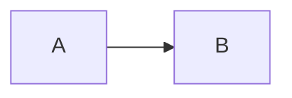

# Markdown Media Viewer

Markdown pages can open article images and Mermaid diagrams in a larger viewer. The viewer can also show a human-written description, so readers can understand what the image is showing without guessing from the filename or alt text.

Use explicit `media-description:for` markers around the visible article text that explains the media. The marker comments are removed at runtime, but the marked text remains visible in the article.

## Image Descriptions

Place the description marker after the image and wrap the paragraph or list that explains it:

```md


<!-- media-description:for ./example.png -->
This paragraph remains visible in the article and is also copied into the media viewer description.

1. Use this list when the screenshot has numbered callouts.
2. Keep the text short enough to read in the viewer controls.
<!-- media-description:end -->
```

Use the same relative path that the markdown image uses. Exact paths such as `./diagram.png` are preferred. The runtime can also match bundled asset URLs generated during the build.

## Mermaid Descriptions

For Mermaid diagrams, reference the diagram by order inside the same markdown body:

````md


<!-- media-description:for mermaid:1 -->
This description is used for the first Mermaid diagram in this markdown body.
<!-- media-description:end -->
````

Use `mermaid:1`, `mermaid:2`, and so on based on the rendered order.

## Writing Guidance

The marker body should work as normal article content. Do not write viewer-only notes that would look strange in the page body.

Good descriptions explain what the reader should notice, especially when the image contains numbered callouts, a process flow, or a dense interface screenshot. Decorative images do not need markers.

Keep the description concise enough for the viewer controls. Long text is allowed, but the viewer description area is constrained by `config/media-viewer.yaml` so it does not take over the whole viewport on mobile devices.

## Runtime Behavior

Normal image files open through the bundled asset URL selected by the browser. Mermaid diagrams open as inline SVG in the viewer so vector rendering is preserved instead of rasterizing the diagram.

Canvas-based media is exported as an in-memory canvas blob using the current device pixel ratio, capped by `config/media-viewer.yaml` `canvas.maximumDevicePixelRatio`. The viewer does not generate physical `@2x` or `@3x` files.

Zoom limits and wheel behavior are controlled by `config/media-viewer.yaml` under `zoom`. The same config also controls the maximum description height and canvas export format.
