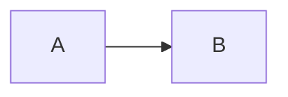

# Markdown Media Viewer

Markdown pages can attach viewer descriptions to images and Mermaid diagrams with explicit comment markers.

Use `media-description:for` around the visible article section that explains the media:

```md


<!-- media-description:for ./example.png -->
This paragraph remains visible in the article and is also copied into the media viewer description.

1. Use this list when the screenshot has numbered callouts.
2. Keep the text short enough to read in the viewer controls.
<!-- media-description:end -->
```

For Mermaid diagrams, use the diagram order on the rendered page:

````md


<!-- media-description:for mermaid:1 -->
This description is used for the first Mermaid diagram in this markdown body.
<!-- media-description:end -->
````

Authoring rules:

- Keep the marker body visible and useful as normal article content; the runtime removes only the marker comments.
- Prefer exact relative image paths such as `./diagram.png`; the runtime also matches bundled asset URLs generated during build.
- Use `mermaid:1`, `mermaid:2`, and so on based on the diagram order inside the same markdown body.
- Do not use the marker for decorative images that do not need a viewer explanation.
