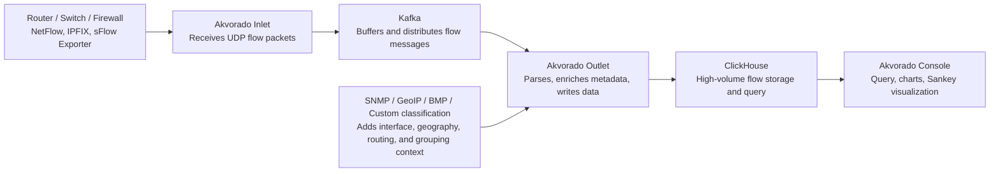
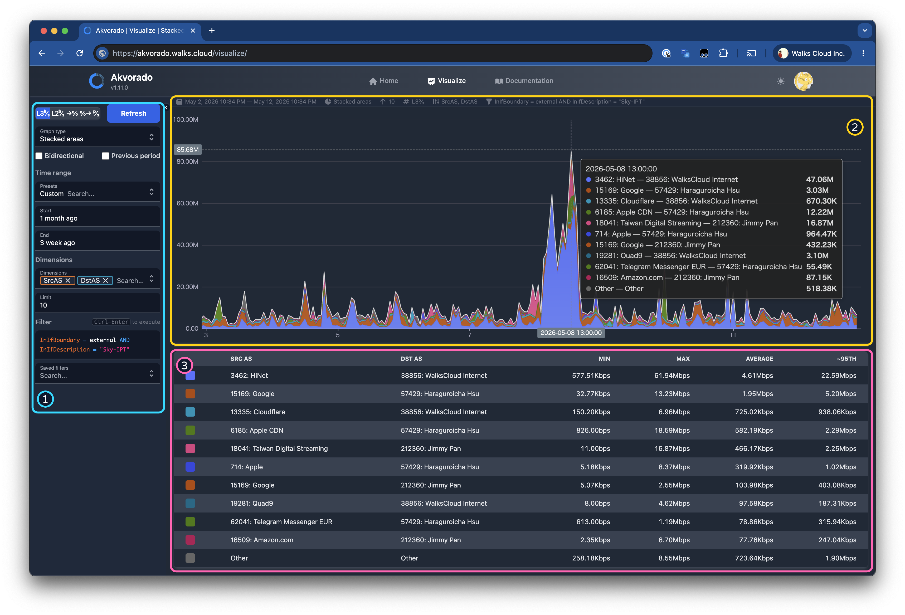

## Traffic problems Akvorado helps solve

Akvorado is a flow collector, enricher, and visualizer. It receives traffic-summary data such as NetFlow/IPFIX/sFlow, enriches it with readable context from SNMP, GeoIP, routing data, or custom classification, writes the result into ClickHouse, and exposes it through a web Console. For enterprise IT teams, it is not a packet-capture platform and it does not replace device monitoring tools such as Zabbix or LibreNMS. Its value is the missing traffic-visibility layer: who is using bandwidth, where traffic is going, and which ASN, country, or service pattern looks abnormal.

Akvorado is worth deploying when a network team can already confirm that devices are online, but still cannot explain why links become full, which external networks dominate traffic, or which site, subnet, customer, or service causes a recurring peak. Typical readers are enterprise IT teams, IDC operators, managed network providers, and organizations that run routers, switches, firewalls, or data-center edge devices with NetFlow/IPFIX/sFlow support.

If these problems keep troubling the environment, Akvorado can provide the traffic evidence needed to narrow the cause:

1. Which Top Talkers are using the most bandwidth during peak hours?
2. Which source or destination ASN, country, subnet, interface, or service group is responsible for an abnormal traffic pattern?
3. Is the Internet uplink, inter-site link, peering path, or data-center edge close to capacity?
4. Can flow data help separate normal business traffic from backup, update, scanning, abuse, or misrouted traffic?

If the goal is to know whether a device is online, whether an interface has errors, or whether CPU/PoE is overloaded, start with SNMP/NMS first. If the goal is packet-level forensics, Akvorado is also not the first tool; use packet capture or mirror-port workflows instead. If the trouble is traffic-source, traffic-destination, protocol, Top Talkers, and peak-behavior visibility, Akvorado is a stronger fit. In WalksCloud planning for [IT Monitoring and Management Systems](/services/it-monitoring/) and [Office Network Deployment and Operations](/services/office-network/), these visibility needs are usually separated before selecting tools.

## Core architecture



<!-- media-description:for mermaid:1 -->
Akvorado’s data path can be understood as six roles:

1. **Exporter**: usually a router, L3 switch, firewall, or Linux flow probe that sends NetFlow/IPFIX/sFlow to the Akvorado Inlet.
2. **Inlet**: receives UDP flow packets and forwards them to Kafka. The official design emphasizes fast reception and buffering, not full parsing at this stage.
3. **Kafka**: buffers data between Inlet and Outlet so short traffic bursts do not immediately overwhelm parsing and storage.
4. **Outlet**: reads from Kafka, decodes flow fields, adds interface, geography, routing, and classification metadata, then writes to ClickHouse.
5. **ClickHouse**: stores and queries high-volume flow records. Retention policy, disk capacity, and query load directly affect stability.
6. **Console**: provides queries, charts, and visualization. Operators usually use it for Top Talkers, traffic direction, ASN/country distribution, and time-series changes.
<!-- media-description:end -->



<!-- media-description:for ./akvorado-console-as-traffic-visualization-annotated.png -->
The Visualize page can split flow data by source AS, destination AS, interface boundary, or custom filters into comparable time-series views. The markers can be read in order:
1. **Query controls**: set the time range, dimensions, and filter so the analysis has a clear scope.
2. **Time-series traffic chart**: shows AS-based stacked traffic for confirming main outbound sources and whether spikes concentrate around specific ASNs.
3. **Statistics table**: summarizes min, max, average, and 95th percentile values so the data can support capacity decisions.
<!-- media-description:end -->

## NetFlow/IPFIX/sFlow differences

NetFlow and IPFIX usually export summarized flow records after a device aggregates traffic for a period of time. They are useful for source, destination, port, protocol, and volume analysis. IPFIX can be treated as the more standardized and flexible flow export format. sFlow is sampling-oriented and sends sampled packet information, so it is common on switches and high-throughput environments, but readers must remember it is sampled data. Do not treat every sFlow record as a complete packet record.

You do not need to enable every format on day one. A practical deployment starts with one major edge device, confirms which export format it supports, then fixes exporter IP, collector port, and sampling/timeout settings. If multiple vendors are involved, align exporter source address, template behavior, and interface index handling first. Otherwise, Console output may show traffic without useful interface names, or the same device may appear as multiple exporters.

## Basic configuration direction

The official Docker Compose example splits configuration into `config/akvorado.yaml`, `config/inlet.yaml`, `config/outlet.yaml`, and `config/console.yaml`. In a basic deployment, the first check is whether Inlet has fixed listening ports. Without explicit configuration, Akvorado may listen on random flow ports, which is unsuitable for production.

```yaml
flow:
  inputs:
    - type: udp
      decoder: netflow
      listen: :2055
      workers: 3
      use-src-addr-for-exporter-addr: true
    - type: udp
      decoder: sflow
      listen: :6343
      workers: 3
```

The point of this example is not to copy the ports blindly. The goal is a documented standard: which ports are used for NetFlow/IPFIX/sFlow, which exporters are allowed, whether source IP is trustworthy, and whether `use-src-addr-for-exporter-addr` is needed to correct exporter address handling. If devices sit behind NAT, VRF, or management-network boundaries, packet source address and exporter address inside the flow message may differ. That affects SNMP lookup and interface-name enrichment.

## Pre-deployment checklist

1. **Device support**: confirm whether core routers, firewalls, and L3 switches support NetFlow v9, IPFIX, or sFlow, and whether they can set collector address and source interface.
2. **Network path**: verify that UDP ports from exporter to collector are not blocked by ACL, firewall, or NAT policy.
3. **Time sync**: keep all devices plus Akvorado, Kafka, and ClickHouse hosts on consistent NTP, or chart timelines will drift.
4. **SNMP access**: if interface names and descriptions matter, the collector must query exporter SNMP. Use read-only community or SNMPv3.
5. **Storage capacity**: ClickHouse stores large volumes of flow data, so define retention days, disk alerts, and backup policy before production use.
6. **Data boundary**: if one collector receives flows from multiple clients, sites, or security zones, plan classification fields and query permissions before data is mixed.

## Common misunderstandings

1. **Akvorado is not packet capture**: flow data is summarized and does not preserve full payload. For packet forensics, use Arkime, tcpdump, or SPAN/mirror designs.
2. **Flow data does not automatically identify users**: if NAT, proxy, VPN, or DHCP records are not correlated, you may only see the edge or relay device.
3. **An empty Console is not always a frontend issue**: check whether Inlet receives packets, then verify Kafka, Outlet, and ClickHouse data movement.
4. **sFlow is not complete metering**: sampling affects precision. It is useful for trends and Top Talkers, not per-packet audit or billing-grade accounting.
5. **GeoIP/ASN fields need maintenance**: if geography or ASN data is blank, inspect GeoIP data source and configuration instead of only checking exporters.

## References

- Akvorado GitHub  
  https://github.com/akvorado/akvorado
- Akvorado Installation  
  https://demo.akvorado.net/docs/install
- Akvorado Configuration  
  https://demo.akvorado.net/docs/configuration
- Akvorado Internal Design  
  https://demo.akvorado.net/docs/internals
