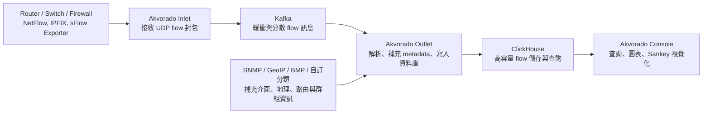

## 這篇 Akvorado 教學適合誰

Akvorado 是一套 flow collector、enricher 與 visualizer。它接收 NetFlow/IPFIX/sFlow 等流量摘要資料，透過 SNMP、GeoIP、路由資訊或自訂分類補上可讀欄位，再將結果寫入 ClickHouse，最後由 Web Console 查詢與視覺化。對企業 IT 而言，它不是封包側錄工具，也不是取代 Zabbix、LibreNMS 這類設備監控系統的工具，而是補上「誰在使用頻寬、流量往哪裡去、哪個 ASN/國家/服務佔比異常」的觀測層。

這篇文章適合已經有網路設備、交換器、Router、防火牆或資料中心出口，並希望用開源工具建立流量可視化的人。若目標是知道設備是否在線、介面是否錯誤、CPU 或 PoE 是否超載，應優先規劃 SNMP/NMS；若目標是知道流量的來源、目的地、應用協定、Top Talkers 與尖峰行為，Akvorado 才是比較適合的切入點。行雲資訊在 [IT 監控與管理系統](/services/it-monitoring/) 與 [辦公室網路建置與維運](/services/office-network/) 的規劃中，通常會先確認這兩類觀測需求是否需要拆開處理。

## 核心架構



Akvorado 的資料流可以分成六個角色：

1. **Exporter**：通常是 Router、L3 Switch、防火牆或 Linux flow probe，負責把 NetFlow/IPFIX/sFlow 指向 Akvorado Inlet。
2. **Inlet**：接收 flow UDP 封包並送進 Kafka。官方設計重點是快速接收與緩衝，資料在這個階段不做完整解析。
3. **Kafka**：作為 Inlet 與 Outlet 之間的緩衝層，讓短時間流量尖峰不會直接壓垮後端解析與寫入流程。
4. **Outlet**：從 Kafka 讀取資料，解析 flow 欄位，補上介面、地理、路由與分類資訊，再寫入 ClickHouse。
5. **ClickHouse**：負責大量 flow 資料儲存與查詢。保留策略、磁碟容量與查詢負載會直接影響整體穩定度。
6. **Console**：提供查詢、圖表與視覺化。使用者通常會在這裡看 Top Talkers、流量方向、ASN/國家分布與時間序變化。


Console 的 Visualize 頁面可以把 flow 資料依來源 AS、目的 AS、介面邊界或自訂條件拆成可比較的時間序圖。圖中標示可依序閱讀：
1. **查詢條件**：包含時間範圍、維度與 filter，用來限定要分析的流量來源與查詢口徑。
2. **時間序流量圖**：以 AS 維度呈現堆疊流量，適合確認主要對外流量來源，以及尖峰是否集中在特定 ASN。
3. **統計表**：整理 min、max、average、95th percentile 等數值，用來判斷資料是否足以支撐後續容量規劃。

## NetFlow/IPFIX/sFlow 的差異

NetFlow 與 IPFIX 通常由設備彙整一段時間內的流量紀錄後送出，適合追蹤來源、目的、port、協定與流量大小。IPFIX 可視為較標準化、欄位彈性更高的 flow export 格式。sFlow 則偏向取樣模式，會把抽樣封包資訊送出，因此在交換器或高流量環境中常見，但讀者必須接受它本質上是 sampled data，不應把每筆 sFlow 資料當成完整封包紀錄。

部署時不需要一開始就同時啟用全部格式。比較務實的作法是先選一個主要出口設備，確認它支援哪一種 export 格式，再固定 exporter IP、collector port 與 sampling/timeout 設定。若資料來源跨多個廠牌，應先把每台設備的 exporter source address、template 行為與介面 index 對齊，否則 Console 看到的資料會變成「有流量但不知道是哪個介面」或「同一設備被辨識成多個 exporter」。

## 基礎設定方向

官方 Docker Compose 範例會把主要設定拆成 `config/akvorado.yaml`、`config/inlet.yaml`、`config/outlet.yaml` 與 `config/console.yaml`。基礎部署時，最先要確認的是 Inlet 是否有固定監聽 port。若沒有設定，Akvorado 可能只用隨機 port 接收 flow，這對正式環境不適合。

```yaml
flow:
  inputs:
    - type: udp
      decoder: netflow
      listen: :2055
      workers: 3
      use-src-addr-for-exporter-addr: true
    - type: udp
      decoder: sflow
      listen: :6343
      workers: 3
```

上例的重點不是照抄 port，而是建立可被文件化的標準：NetFlow/IPFIX/sFlow 分別使用哪些 port、哪些 exporter 可以送進來、source IP 是否可信、是否需要用 `use-src-addr-for-exporter-addr` 修正 exporter address。若設備在 NAT、VRF 或管理網段後方，source address 與 flow message 內的 exporter address 可能不同，這會影響 SNMP 查詢與介面名稱補充。

## 部署前盤點清單

1. **設備支援**：確認核心 Router、防火牆、L3 Switch 是否支援 NetFlow v9、IPFIX 或 sFlow，以及是否能指定 collector address 與 source interface。
2. **網路路徑**：確認 exporter 到 collector 的 UDP port 未被 ACL、防火牆或 NAT 擋下。
3. **時間同步**：所有設備、Akvorado、Kafka、ClickHouse 主機都應有一致 NTP，否則圖表時間軸會失真。
4. **SNMP 權限**：若要顯示介面名稱與描述，collector 必須能查詢 exporter 的 SNMP。建議使用唯讀 community 或 SNMPv3。
5. **儲存容量**：ClickHouse 會保存大量 flow 資料，必須先定義保留天數、磁碟告警與備份策略。
6. **資料分界**：若同一套 collector 接收多個客戶、站點或安全區域的 flow，必須先規劃分類欄位與查詢權限，不要等資料混在一起後再補救。

## 常見誤解

1. **Akvorado 不是封包側錄**：flow 只提供摘要，不會保留完整 payload。需要封包鑑識時仍需 Arkime、tcpdump 或鏡像埠方案。
2. **有 flow 不代表能直接定位使用者**：若 NAT、Proxy、VPN 或 DHCP 記錄沒有串起來，看到的可能只是出口或中繼設備。
3. **Console 沒資料不一定是前端問題**：先查 Inlet 是否收到封包，再查 Kafka、Outlet、ClickHouse 是否有資料流動。
4. **sFlow 不等於完整計量**：sampling 設定會影響精度，適合趨勢與 Top Talkers，不適合做逐筆計費或封包級稽核。
5. **GeoIP/ASN 欄位要維護**：如果地理或 ASN 欄位空白，通常要回頭檢查 GeoIP 資料來源與設定，而不是只看設備端 exporter。

## 參考資料

- Akvorado GitHub  
  https://github.com/akvorado/akvorado
- Akvorado Installation  
  https://demo.akvorado.net/docs/install
- Akvorado Configuration  
  https://demo.akvorado.net/docs/configuration
- Akvorado Internal Design  
  https://demo.akvorado.net/docs/internals
