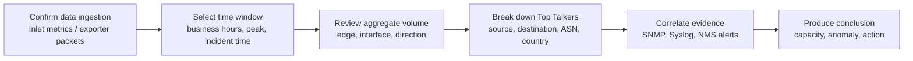
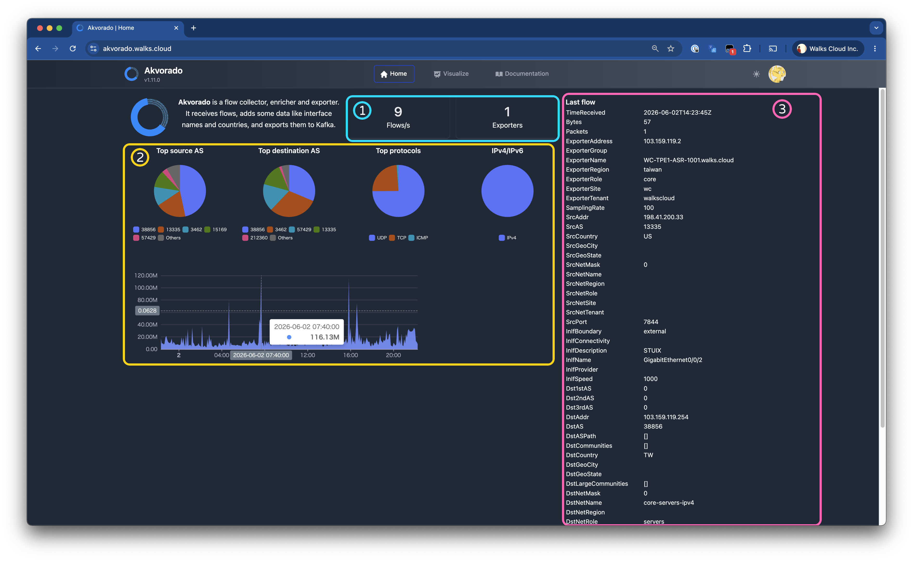

## Analysis prerequisites

After Akvorado is deployed, the real value is not attractive charts. The value is converting flow data into repeatable operational questions. Common questions include which device or VLAN consumes internet bandwidth, whether backup links actually carry traffic, whether a spike comes from one host, whether external traffic concentrates around unexpected ASNs or countries, and whether capacity upgrades are supported by data.

Before analysis, validate data quality. Exporters must send flows consistently, Inlet metrics should show packet counters increasing, Outlet should continue writing into ClickHouse, and only then should Console be used for trend interpretation. If the data source itself is unstable, Top Talkers and geography charts may reflect exporter interruption, sampling changes, or failed SNMP enrichment rather than real traffic behavior.

## Recommended analysis workflow

<!-- media-description:for mermaid:1 -->
The important rule is not to start with one IP address. Confirm the time window first, check aggregate volume, split talkers and direction, then correlate with SNMP, Syslog, and NMS alerts. For [IT Monitoring and Management Systems](/services/it-monitoring/), flow analysis is usually the second layer of evidence that explains why an indicator is abnormal. It should not replace the alerting system.
<!-- media-description:end -->

<!-- media-description:for ./akvorado-console-home-traffic-overview-annotated.png -->
The Console home view is a useful first checkpoint. The markers can be read in order:
1. **Ingestion status**: flows/s and exporters confirm whether Inlet is receiving flow data and how many exporters are identified.
2. **Traffic summary charts**: top source AS, top destination AS, protocol distribution, and time-series spikes show the main traffic sources at a glance.
3. **Last flow panel**: lets the operator verify exporter, interface, and enrichment fields before deeper analysis starts.
<!-- media-description:end -->

## Top Talkers analysis

Top Talkers is the easiest Akvorado use case to understand, but it is also easy to misuse. If the largest IP is treated as the source of the problem, NAT gateways, proxies, VPN servers, or backup servers may be blamed incorrectly. A more stable method switches dimensions in sequence:

1. **Source address**: identify which internal IP, VLAN, or site sends the most traffic.
2. **Destination address**: check whether traffic is concentrated around SaaS, cloud platforms, CDN, backup endpoints, or unknown external hosts.
3. **Direction**: distinguish upload, download, site-to-site traffic, and east-west data-center traffic.
4. **Port/protocol**: decide whether the behavior matches expected services such as backup, video meetings, file sync, VPN, or heavy DNS/HTTP(S).
5. **ASN/country**: if outbound traffic concentrates around unfamiliar ASNs or countries, correlate with DNS, proxy, or firewall logs before drawing conclusions.

Keep a normal baseline during analysis. A cloud backup every morning or weekly system-update traffic may be expected. The real issue is behavior that deviates from baseline: wrong time, wrong destination, wrong source device, wrong direction, or sudden growth large enough to affect service quality.

## Anomaly interpretation

Abnormal traffic does not always mean a security incident. It can be user behavior, backup scheduling, cloud sync, weak network design, or device misconfiguration. Akvorado helps narrow the scope first, then the team can decide whether packet capture, endpoint inspection, or firewall logs are needed.

1. **Short traffic spike**: check whether it is concentrated on one exporter or interface. If only one device spikes, exporter sampling, template behavior, or reboot timing may be involved.
2. **Large outbound connection volume**: review destination ASN, country, and port, then compare DNS and proxy logs. Do not classify traffic as hostile only because the country looks unfamiliar.
3. **High internal traffic**: if source and destination are both internal, check backup jobs, file migration, virtualization movement, or NAS synchronization.
4. **Possible DDoS or scanning**: flow data can confirm direction, source concentration, and protocol distribution, but packet content and firewall rule hits still need separate evidence.
5. **Slow long-term increase**: this usually looks more like capacity pressure than a single incident. Use 95th percentile, peak/off-peak gap, and periodic trend comparison.

## Capacity planning

If flow analysis is only used after incidents, its value is underestimated. Akvorado can also support capacity planning for office internet edge, data-center egress, site VPN, backup links, and large file synchronization.

1. **Define observation period**: include at least one complete business cycle, such as 7 days, 30 days, or a monthly reporting cycle.
2. **Watch 95th percentile**: average hides peaks, while max values are easily polluted by one-off events.
3. **Separate direction and type**: review internet upload/download, site-to-site traffic, internal east-west traffic, and backup/sync traffic separately.
4. **Mark known events**: software updates, backup retries, campaigns, relocations, and hardware refreshes should be annotated to avoid false growth conclusions.
5. **Translate into decisions**: the conclusion should answer whether to upgrade circuits, shift backup windows, apply QoS, or change topology.

## No-data troubleshooting sequence

1. **Exporter packets**: use `tcpdump` on the collector to confirm UDP flow packets reach the expected port.
2. **Inlet metrics**: check counters such as `akvorado_inlet_flow_input_udp_packets_total` and confirm exporters appear.
3. **Exporter address**: if the reported exporter address is unreliable, evaluate `use-src-addr-for-exporter-addr`.
4. **Kafka/Outlet path**: if Inlet receives data but Console stays empty, inspect Kafka topic flow, Outlet consumer behavior, and ClickHouse writes.
5. **Blank GeoIP/ASN fields**: this usually indicates enrichment data or configuration problems, not necessarily missing flow data.
6. **Query time window**: if Console time range does not overlap with the actual exporter data window, it will look empty.

## Operational cadence

Akvorado works best as part of scheduled inspection, not only during incidents. At least monthly or quarterly, summarize edge volume, Top Talkers, site traffic, ASN/country distribution, and major spikes. If the organization already uses Zabbix, LibreNMS, Grafana, or Graylog, Akvorado reports should align with the existing alert timeline so bandwidth, error rate, device state, and flow evidence share one incident context.

In WalksCloud network and monitoring services, this evidence is converted into trackable improvement work: shifting backup windows, redesigning VLANs, limiting specific egress paths, upgrading circuits, strengthening firewall rules, or improving remote-site return paths. The tool itself is not the outcome. Turning traffic visibility into executable decisions is the real value of flow analysis.

## References

- Akvorado Usage  
  https://demo.akvorado.net/docs/usage
- Akvorado Operations  
  https://demo.akvorado.net/docs/operations
- Akvorado Troubleshooting  
  https://demo.akvorado.net/docs/troubleshooting
- Akvorado Configuration  
  https://demo.akvorado.net/docs/configuration
