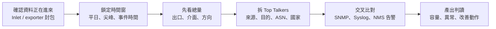

## 分析前提

Akvorado 部署完成後，真正有價值的不是「看到漂亮圖表」，而是能把流量資料轉成可重複判讀的營運問題。常見問題包含：哪台設備或哪個 VLAN 長期吃掉出口頻寬、備援線路是否真的承擔流量、異常尖峰是否來自單一主機、對外連線是否集中到不合理的 ASN 或國家，以及容量擴充是否有數據支撐。

在開始分析前，先確認資料品質。Exporter 必須穩定送出 flow，Inlet 要能穩定接收封包，Outlet 要能持續把資料寫入 ClickHouse，Console 才能用來判斷趨勢。若資料來源本身不穩，後續任何 Top Talkers（在指定時間窗內流量最高的來源、目的或分類對象）或地理分布都可能只是 exporter 中斷、sampling 調整或 SNMP enrichment 失敗造成的假象。

本文會反覆使用幾個 Akvorado 術語，先用中文說明如下：

1. **Inlet**：Inlet 是 Akvorado 接收 NetFlow/IPFIX/sFlow 封包的服務，負責先把 exporter 送來的 flow 封包收進 collector，再交給後面的 Kafka 與 Outlet 處理。
2. **Outlet**：Outlet 是從 Kafka 讀取 flow 訊息、解析欄位、補充 metadata，並把結果寫入 ClickHouse 的服務；若 Inlet 有收到資料但 Console 沒內容，Outlet 是必查環節。
3. **ClickHouse**：ClickHouse 是 Akvorado 用來保存大量 flow 資料的欄式資料庫，負責支撐長時間區間、Top Talkers 與多維度查詢。
4. **sampling**：sampling 是取樣概念，代表設備可能只送出部分封包或抽樣後的流量紀錄；它適合看趨勢與主要流量來源，但精度會受取樣率影響。
5. **SNMP enrichment**：SNMP enrichment 是 Akvorado 透過 SNMP 查詢設備介面名稱、描述等資訊，將原本難讀的介面 index 補成可理解的欄位，方便後續判讀流量來源與出口。

## 建議分析流程

這個流程的重點是不要一開始就鑽進單一 IP。先確認時間窗，再確認總量，接著拆出主要 talkers 與流量方向，最後才把結果與 SNMP、Syslog、NMS 告警對齊。對 [IT 監控與管理系統](/services/it-monitoring/) 而言，flow 分析通常是「解釋為什麼指標異常」的第二層資料，而不是取代原本的告警系統。

Console 首頁適合作為第一步檢查點。圖中標示可依序閱讀：
1. **資料進入狀態**：flows/s 與 exporters 可確認 Inlet 是否正在收到 flow，以及目前有多少 exporter 被辨識。
2. **流量摘要圖表**：Top source AS、Top destination AS、protocol 分布與時間序圖能快速觀察主要流量來源與尖峰。
3. **Last flow 欄位**：可回頭檢查 exporter、介面與 enrichment 欄位是否符合預期，避免後續分析建立在錯誤資料上。

## Top Talkers 分析

Top Talkers 指的是在指定時間範圍內，依流量大小排序後最主要的來源、目的或分類對象，例如某個 IP、VLAN、ASN、國家或 port/protocol。這是最容易被理解的 Akvorado 使用情境，但也最容易被誤用。若直接把最大流量 IP 當成問題來源，可能會誤判 NAT Gateway、Proxy、VPN Server 或備份伺服器。比較穩定的做法是依序切換維度：

1. **來源位址**：找出哪些內部 IP、VLAN 或站點送出最多流量。
2. **目的位址**：確認流量是否集中到特定 SaaS、雲端平台、CDN、備份端點或未知外部主機。
3. **方向**：分清楚是上行、下行、站點間流量，還是資料中心內部橫向流量。
4. **Port/Protocol**：判斷是否符合預期服務，例如備份、視訊會議、檔案同步、VPN 或大量 DNS/HTTP(S)。
5. **ASN/國家**：對外流量若集中到陌生 ASN 或不合理國家，需再與 DNS、Proxy 或防火牆 log 交叉確認。

分析時要保留「正常基準」。例如同一間辦公室每天上午固定有雲端備份，或每週固定有系統更新流量，這些不是異常。真正需要處理的是流量型態偏離基準：時間不對、目的地不對、來源設備不對、方向不對，或同一行為突然放大到影響服務品質。

## 異常流量判讀

異常流量不一定代表資安事件，也可能是使用者行為、備份排程、雲端同步、弱網路設計或設備設定錯誤。Akvorado 的價值在於先縮小範圍，再決定是否要進一步用封包側錄、端點調查或防火牆 log 驗證。

1. **短時間尖峰**：先看是否集中於單一 exporter 或單一介面；若只有一台設備突然放大，可能是 exporter sampling、template 或設備重啟造成。
2. **大量對外連線**：先看目的 ASN、國家與 port，再比對 DNS 查詢與 Proxy log。不要只因國家陌生就判定為攻擊。
3. **大量站內流量**：若來源與目的都在內部，需確認是否為備份、檔案搬移、虛擬化遷移或 NAS 同步。
4. **疑似 DDoS 或掃描**：flow 可協助確認方向、來源集中度與協定分布，但封包內容與防火牆命中規則仍需另外佐證。
5. **長期緩慢上升**：通常比較像容量問題，而不是單次事件。應看 95th percentile、尖離峰差距與週期趨勢。

## 容量規劃

流量分析若只用在事件發生後排障，價值會被低估。Akvorado 也可以支援容量規劃，尤其是辦公室 Internet Edge、資料中心出口、站點 VPN、備援線路與大型檔案同步場景。

1. **定義觀察週期**：至少涵蓋一個完整業務週期，例如 7 天、30 天或一個月結帳/報表週期。
2. **觀察 95th percentile**：不要只看平均值。平均值會掩蓋尖峰，最大值又容易被單一事件污染。
3. **拆分方向與類型**：分別看 Internet 上下行、站點間流量、內部橫向流量與備份/同步流量。
4. **標記已知事件**：例如軟體更新、備份重跑、促銷活動、搬遷、設備汰換，避免把已知事件誤判為自然成長。
5. **轉成決策語言**：結論應回到「是否升級線路」、「是否調整備份時間」、「是否做 QoS」、「是否改變拓樸」。

## 查不到資料時的檢查順序

1. **Exporter 是否送出封包**：在 collector 上用 `tcpdump` 確認 UDP flow port 是否有封包進來。
2. **Inlet metrics 是否增加**：檢查 `akvorado_inlet_flow_input_udp_packets_total` 這類指標是否出現 exporter。
3. **Exporter address 是否正確**：若設備回報的 exporter address 不可靠，評估是否使用 `use-src-addr-for-exporter-addr`。
4. **Kafka/Outlet 是否正常**：若 Inlet 有資料但 Console 沒資料，往 Kafka topic、Outlet consumer 與 ClickHouse 寫入方向查。
5. **GeoIP/ASN 是否空白**：這通常是 enrichment 資料來源或設定問題，不一定是 flow 收不到。
6. **時間窗是否選錯**：Console 查詢時間若沒有覆蓋 exporter 實際送資料的時間，也會看起來像沒有資料。

## 營運節奏

Akvorado 適合被放進固定巡檢，而不是只在異常時打開。建議每月或每季至少整理一次出口總量、Top Talkers、站點流量、ASN/國家分布與重大尖峰。若企業已有 Zabbix、LibreNMS、Grafana 或 Graylog，Akvorado 的報告應與既有告警時間軸對齊，讓頻寬、錯誤率、設備狀態與 flow 證據可以放在同一個事件脈絡中。

行雲資訊在網路與監控服務中，會把這類資料轉成可追蹤的改善項目：例如調整備份時間、重新規劃 VLAN、限制特定出口、擴充線路、補強防火牆規則或改善遠端站點回傳路徑。工具本身不是成果，能把觀測資料變成可執行決策，才是流量分析真正的價值。

## 參考資料

- Akvorado Usage  
  https://demo.akvorado.net/docs/usage
- Akvorado Operations  
  https://demo.akvorado.net/docs/operations
- Akvorado Troubleshooting  
  https://demo.akvorado.net/docs/troubleshooting
- Akvorado Configuration  
  https://demo.akvorado.net/docs/configuration
