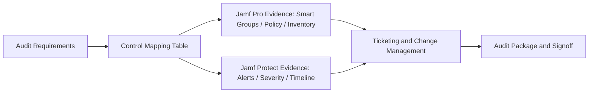
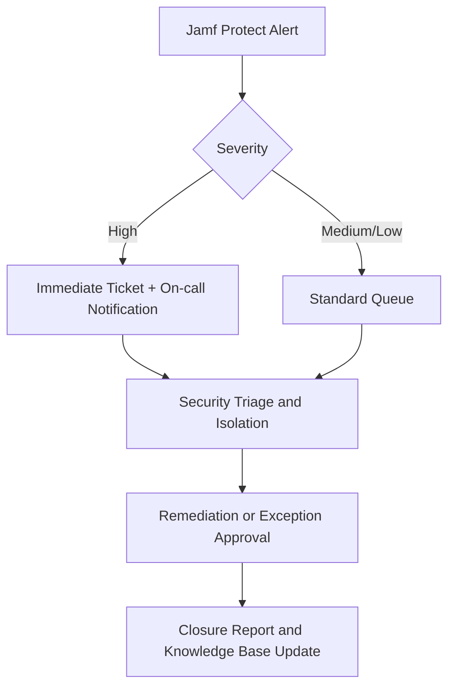

## Audit challenge

- Jamf Pro and Jamf Protect controls are often spread across many policies; audits become slow when ownership is unclear.
- Auditors typically request incident records, policy-change history, and evidence archives.
- Most teams do have data, but evidence chains break because records live in disconnected systems (Jamf Pro, Jamf Protect, ticketing, document stores).

## Define audit scope first (avoid last-minute evidence scramble)

1. **Governance scope**: who can change policy, who can approve exceptions, and who owns closure decisions.
2. **Technical scope**: device inventory, encryption posture, key-policy coverage, and threat-response timing.
3. **Evidence scope**: policy versions, device lists, incident handling records, change history, and report outputs.

Build a control-mapping table before audit day so every audit question maps to a specific Jamf data source and owner.

## WalksCloud implementation model

1. **Role ownership**: define responsibility for policy authoring, incident response, and report export across MIS, security, HR, and related teams.
2. **Document templates**: maintain reusable policy lists, device audit sheets, and incident records for direct PDF export.
3. **Incident workflow**: when Jamf Protect triggers an alert, create a ticket automatically, assign security review, and attach logs plus handling summary at closure.
4. **Version control**: keep policies, scripts, and audit documents in Git or equivalent systems for who/when/why traceability.

## Practical implementation steps

### Step 1: Define RACI and accountability boundaries

- `R (Responsible)`: MIS platform operators who implement and deploy controls.
- `A (Accountable)`: security owners who define audit criteria and risk acceptance.
- `C (Consulted)`: HR/compliance stakeholders for personnel lifecycle and policy obligations.
- `I (Informed)`: business managers receiving audit outcomes and remediation timeline.

Core principle: policy change ownership, evidence retention, and exception approval must all be traceable.

### Step 2: Freeze audit scope with Smart Groups

- Avoid handpicked machine lists; define scope with Smart Group conditions (OS version, encryption status, agent state).
- Apply naming conventions and usage notes to every Smart Group.
- Separate "audit Smart Groups" from day-to-day operations Smart Groups to prevent unintended coupling.

### Step 3: Event flow and SLA discipline

- After Jamf Protect severity classification, create tickets automatically with severity tags.
- Define SLA per severity (for example, high-risk alerts acknowledged within 4 hours and initial assessment within 24 hours).
- Closure must include three items: original alert, analysis timeline, and remediation/recovery timing.

### Step 4: Versioning and evidence archive controls

- Put policies, configuration profiles, scripts, and report templates under version control.
- Standardize every evidence pack as: `Scope -> Control -> Evidence -> Conclusion -> Exception`.
- Before archival, run a third-party readability drill: a non-project member should be able to reconstruct the evidence chain.

## Recommended audit evidence checklist

- Audit-period reports (policy inventory, incident summary, device list).
- Improvement actions (automation updates, threshold tuning, policy refinement).
- Change logs (when, who, and why each control changed).
- Exception register (rationale, approver, and expiry date).

## Practical benefits

- Audit preparation shifts from "find data during audit" to "continuous evidence readiness".
- Jamf acts as control plane, ticketing as response plane, and version control as evidence plane, creating an end-to-end governance loop.
- When standards evolve, teams can expand controls from existing templates instead of rebuilding the process from scratch.

## References

- Jamf Pro Documentation: Smart Groups  
  https://learn.jamf.com/en-US/bundle/jamf-pro-documentation-current/page/Smart_Groups.html
- Jamf Pro Developer: API Overview  
  https://developer.jamf.com/jamf-pro/
- Jamf Pro Developer: Jamf Log Stream  
  https://developer.jamf.com/jamf-pro/docs/jamf-log-stream
- Jamf Protect Documentation: About Jamf Protect / Alert Severity  
  https://learn.jamf.com/r/en-US/jamf-protect-documentation
