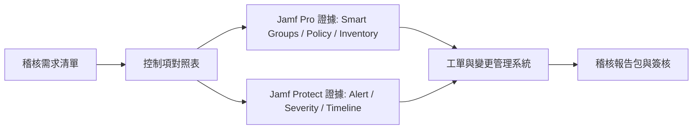
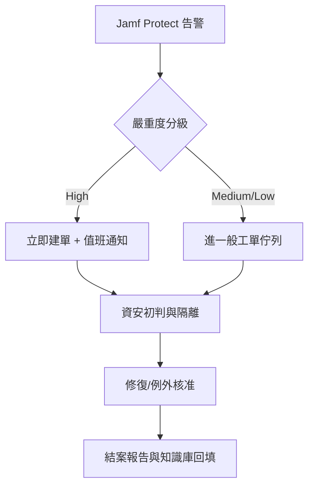

## 稽核挑戰

- Jamf Pro / Jamf Protect 組態分散於多個政策，稽核時若找不到負責人會耗費大量時間。
- 稽核單位常要求提供事件紀錄、政策變更紀錄與封存資料。
- 多數團隊的問題不是「沒有資料」，而是資料散落在不同系統（Jamf Pro、Jamf Protect、工單系統、檔案庫），導致證據鏈斷裂。

## 稽核範圍先定義（避免臨場補件）

1. **治理面**：誰有權改政策、誰可核准例外、誰負責結案。
2. **技術面**：裝置盤點、加密狀態、關鍵政策覆蓋率、威脅事件回應時效。
3. **證據面**：政策版本、裝置清單、事件處置紀錄、變更紀錄與報告輸出。

建議先定義「控制項對照表」：每一個稽核問題要能對應到 Jamf 資料來源與負責部門，避免稽核當天才找資料。

## 行雲資訊的做法

1. **角色分工**：定義政策撰寫、事件回應、報告匯出的負責部門（例如 MIS、資安、HR）。
2. **文件模板**：建立政策清單、裝置稽核表與事件紀錄表，稽核時即可輸出 PDF 提供審查。
3. **事件流程**：一旦 Jamf Protect 報警，自動建立工單並請資安窗口確認；結案後附上 log 與處置摘要。
4. **版本控管**：政策、腳本與稽核文件都放在 Git 或版本系統，便於追蹤誰在何時修改。

## 實作步驟（可直接套用）

### Step 1：建立 RACI 與責任邊界

- `R (Responsible)`：MIS 平台管理者，負責政策建置與部署。
- `A (Accountable)`：資安主管，負責稽核口徑與風險接受。
- `C (Consulted)`：HR / 法遵，負責人員異動與合規要求同步。
- `I (Informed)`：業務單位主管，接收稽核結果與改善排程。

關鍵原則是「誰改政策、誰留證據、誰核准例外」三件事要可追溯。

### Step 2：用 Smart Group 固化稽核口徑

- 不要用手動挑機器清單，改用 Smart Group 條件定義稽核範圍（例如 OS 版本、加密狀態、Agent 安裝狀態）。
- 每個 Smart Group 需有命名規則與用途註記，避免後續變成黑箱條件。
- 建議把「稽核版 Smart Group」與「日常維運 Smart Group」分開，避免互相影響。

### Step 3：事件流程與時效 SLA

- Jamf Protect 告警分級後，自動建立工單並標註嚴重度。
- 為每個等級設定 SLA（例如高風險告警 4 小時內回應、24 小時內給初判）。
- 結案必須附三項資訊：原始告警、分析過程、處置與復原時間。

### Step 4：版本控管與證據封存

- Policy、Configuration Profile、腳本與報告模板都要進版控。
- 每次稽核證據包都要有固定結構：`範圍 -> 控制項 -> 證據 -> 結論 -> 例外`。
- 封存前先做一次「第三方視角」演練：由非專案成員依文件重建證據鏈，確認可讀性。

## 稽核技術證據清單

- 稽核期間的報告（政策清單、事件摘要、裝置列表）。
- 後續改善建議（例如自動化腳本、警示門檻調整）。
- 變更紀錄（政策異動時間、異動人、異動原因）。
- 例外清單（為何例外、誰核准、何時到期）。

## 實務效益

- 稽核準備從「臨時找資料」轉成「平時即留痕」，通常可大幅降低跨部門溝通成本。
- 把 Jamf 當成控制面、工單系統當成處置面、版控系統當成證據面，可形成完整閉環。
- 即使稽核標準更新，仍可沿用既有模板快速擴充控制項，而不需重建流程。

## 參考資料

- Jamf Pro Documentation: Smart Groups  
  https://learn.jamf.com/en-US/bundle/jamf-pro-documentation-current/page/Smart_Groups.html
- Jamf Pro Developer: API Overview  
  https://developer.jamf.com/jamf-pro/
- Jamf Pro Developer: Jamf Log Stream  
  https://developer.jamf.com/jamf-pro/docs/jamf-log-stream
- Jamf Protect Documentation: About Jamf Protect / Alert Severity  
  https://learn.jamf.com/r/en-US/jamf-protect-documentation
