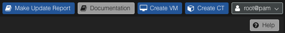
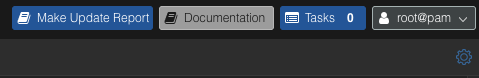

## 適用情境

- 客戶委託我們長期維護 PVE (Proxmox VE, Proxmox Virtual Environment) 或 PBS (Proxmox Backup Server) 環境，需要定期確認更新、備份與儲存容量狀態。
- 需要可追溯的文件，方便多位主管或合作夥伴同步狀態。
- 環境跨多節點或多儲存池時，日常觀察不易看出長期趨勢，需要固定口徑做季度對比。

## 技術欄位組成

1. **Updates Data（可更新套件表）**：以 `Origin` 分組列出 `Package / current / new / Description`。`new` 欄位即該次排程更新後要落地的最終版本。
2. **Backup Summary Data（30 天任務摘要）**：Backups、Prunes、Garbage collections、Syncs、Verify、Tape Backup、Tape Restore 的 `Fail / Warning / Success` 統計。
3. **Backup Usage Data（Datastore 使用狀態）**：Usage 百分比、Estimated Full、CT/Host/VM 的 Group 與 Snapshot 數、最後一次 GC 的去重倍率。
4. **Backup Snapshots List Data（快照清單）**：依時間排序列出快照路徑與保護狀態，作為抽查與追溯依據。
5. **環境差異註記**：PVE/PBS 環境一定會有 Updates Data；只有 PBS 環境才會額外輸出備份摘要、容量與快照清單。

## 指標口徑（避免季度間不可比）

1. **套件版本口徑**：`current -> new` 代表該次操作前後版本差異，季度報告中的新版本即實際更新目標版本，不再另做推估欄位。
2. **任務結果口徑**：`status` 含 `ok` 計 Success，含 `warning` 計 Warning，其餘狀態計 Fail，全部以 30 天視窗統一比較。
3. **任務分類口徑**：以「備份任務類型」欄位做分類，依值拆為 backup/prune/garbage/sync/verify/tape backup/tape restore，不混入其他任務類型。
4. **容量口徑**：Usage 與 Estimated Full 直接使用 PBS 回傳值；Backup Count 只列 CT/Host/VM 三類，維持跨季度欄位固定。
5. **快照口徑**：快照清單保留「備份資料類型 / 備份資料識別碼 / 時間 / 保護註記」欄位，做為異常時的人工作業追溯主索引。

## 產出流程

1. **在受控 Web UI 條件下執行報表腳本**：`Make Update Report` 按鈕只會在「指定 connector 網域 + 內部 userscript」同時成立時出現，確保腳本僅在受控邊界內使用、避免未授權環境誤觸。此設計不需改動 PVE/PBS 原始安裝，也可降低資料外洩風險。  
   - PVE 介面示例截圖： 
     <!-- media-description:for ./make-update-report-button-pve.png -->
     這張 PVE 示例截圖呈現受控的 `Make Update Report` 按鈕位於原生 Documentation、Create VM 與 Create CT 操作旁。這種位置讓維運人員容易辨識報表入口，同時仍限制在指定 connector 網域與內部 userscript 條件下才會出現。
     <!-- media-description:end -->
   - PBS 介面示例截圖： 
     <!-- media-description:for ./make-update-report-button-pbs.png -->
     這張 PBS 示例截圖呈現相同的受控報表按鈕出現在備份伺服器介面。PVE 與 PBS 採一致入口，可降低季度報表產出時的人工操作差異，也不需要修改原始安裝內容。
     <!-- media-description:end -->
2. **在同一操作中完成更新與報表產出**：以固定流程一次產出更新結果與報表欄位，減少人工轉抄錯誤。這可維持跨季度資料口徑一致。
3. **可休眠 VM 先休眠再更新**：先關閉對應 QEMU process，讓 VM 恢復時載入更新後 binary。此步驟可降低未完成運算或寫入作業被更新中斷而失敗的風險，即使在夜間窗口也保留安全邊界。
4. **重開機 PVE/PBS 主機使更新生效**：主機重開後套用新 kernel 與套件執行環境。完成後再進入服務恢復與檢核。
5. **對 LXC 套用重開機後恢復流程**：LXC 不支援休眠，會隨 host 重開而停止。主機恢復後依既定順序啟動並確認服務狀態。

## 異常判讀與改善方向

1. **僅在有 Error/Fail log 時納入異常段落**：季度報告只記錄已觀測到的異常事件與處理過程，不把正常維運項目混入異常章節。
2. **可修復問題優先內部處理**：可在維運窗口內修復的項目先處理，不立即通報；僅在影響持續、風險擴大或有協議要求時才升級通知。
3. **人工巡檢節奏為 1-2 週**：以人工檢視 log 為原則，不預設每日巡檢或即時推播。
4. **未約定則不啟用主動推播**：若合約未要求日常事件通知，報告以季度節奏輸出，不額外建立告警推送流程。
5. **改善建議以可執行變更為主**：每項異常對應一個可落地調整（排程、容量、保留策略或版本修正），避免只列觀察不列行動。

## 參考資料

- Proxmox VE Documentation  
  https://pve.proxmox.com/pve-docs/
- Proxmox Backup Server Documentation  
  https://pbs.proxmox.com/docs/
