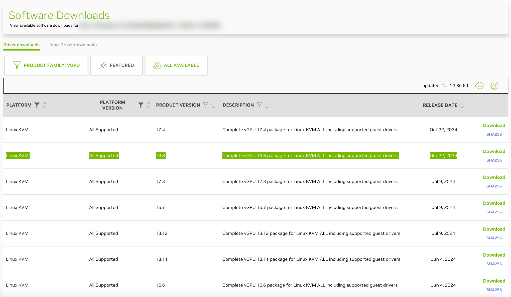
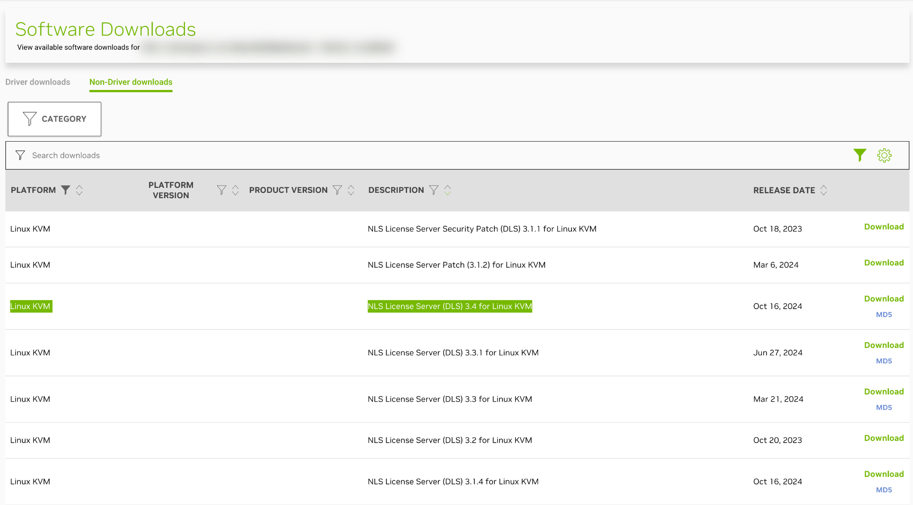

## Rollout context

- This guide structures PVE plus NVIDIA vGPU deployment into repeatable stages.
- Target model: PVE 8.x with profile-based GPU resource pooling, with host, licensing, and guest workflows aligned.
- Focus is on version alignment, standardized execution, and repeatable technical validation, not one-time boot success.

## 0. Driver and licensing preparation

1. Confirm the target GPU model’s last supported vGPU version from official NVIDIA vGPU documentation.
2. Download the matching **Linux KVM Host Driver** and **Guest Driver** packages from NVIDIA Licensing.
   
3. Download the matching **NLS/DLS License Server for Linux KVM** image.
   
4. Before execution, record host-driver, guest-driver, and license-server versions in one approved change ticket to prevent mixed-version rollout.

## 1. PVE host setup (IOMMU, `vfio`, required packages)

- Upgrade host to stable PVE baseline.
- Apply IOMMU kernel parameters and enable `vfio` modules.
- Install required package: `dkms`、`proxmox-default-headers`、`mdevctl`、`build-essential`.
- Run `update-grub` and `update-initramfs`, then reboot.

```bash
# block Open Source version of NVIDIA driver
echo "blacklist nouveau" >> /etc/modprobe.d/blacklist.conf

# vfio module enable
echo -e "vfio\nvfio_iommu_type1\nvfio_pci\nvfio_virqfd" >> /etc/modules

# install passthrough needed packages
apt update
apt install --no-install-recommends -y \
  dkms libc6-dev proxmox-default-headers git build-essential mdevctl

update-grub
update-initramfs -u -k all
```

## 2. vGPU unlock and SR-IOV service integration

- Configure `vgpu_unlock-rs` and service-level preload `LD_PRELOAD` strategy where required by deployment policy.
- Register `nvidia-sriov.service` and enable startup service for `sriov-manage -e ALL` execution.
- Validate on test node before production expansion.

```bash
systemctl daemon-reload
systemctl enable --now nvidia-sriov.service
systemctl status nvidia-sriov.service
```

## 3. Host driver installation and `mdev` validation

- After reboot, verify GPU discovery with `lspci -d 10de:`.
- Install host driver with `--dkms` mode.
- Reboot and validate available profiles via `mdevctl types`.

```bash
lspci -d 10de:
chmod +x NVIDIA-Linux-*.run
./NVIDIA-Linux-*.run --dkms
mdevctl types
```

## 4. Deploy NVIDIA DLS license service VM

- Create Linux VM (you can start with `Do not use any media`) and then import license service image (`.qcow2`).
- Upload `nls-*.qcow2` to PVE storage path (for example `/var/lib/vz/template/iso`).
- Use `qm importdisk` and attach as primary virtual disk (`virtio0`); resize as needed.
- Start VM, open HTTPS interface, import instance token, and upload license artifacts downloaded from NVIDIA.

```bash
qm importdisk 999 /var/lib/vz/template/iso/nls-3.4.0-bios.qcow2 Data
qm disk resize 999 virtio0 20G
```

## 5. Windows guest onboarding and license binding

- Create Windows VM (`Machine: q35`、`BIOS: OVMF`、`CPU: host`), plus VirtIO driver media via ISO file.
- Add PCI device with matching NVIDIA raw device and MDev type profile (e.g. `GRID P4-2Q`).
- Install Windows baseline, then VirtIO/guest agent, then NVIDIA guest driver.
- Apply Client Config Token from DLS to expected path and restart `NVIDIA Display Container LS` service.

## 6. Technical validation checklist

1. **Functional checks**: `mdevctl types`, guest-driver state, license state, and GPU workload behavior are normal (e.g. `nvidia-smi`).
2. **Stability checks**: repeated reboot and stress tests preserve MDev attach behavior.
3. **Restore checks**: sampled VM backup/restore preserves license and MDev usability.
4. **Operational consistency checks**: different operators can reproduce new-VM onboarding with same SOP.

## Practical guidance

- In mixed-GPU environments, complete single-node rollout and stress validation first, then expand.
- Upgrade sequence should follow host driver -> DLS -> guest driver, with explicit rollback plan.
- Feed rollout steps, validation outcomes, and failure cases into internal knowledge base for scale-out reuse.

## References

- Proxmox VE Wiki: NVIDIA vGPU on Proxmox VE  
  https://pve.proxmox.com/wiki/NVIDIA_vGPU_on_Proxmox_VE
- Proxmox VE Wiki: PCI Passthrough  
  https://pve.proxmox.com/wiki/PCI_Passthrough
- Proxmox VE `vzdump` Documentation  
  https://pve.proxmox.com/pve-docs/vzdump.1.html
- Proxmox Backup Server Documentation  
  https://pbs.proxmox.com/docs/
- NVIDIA vGPU Client Licensing User Guide  
  https://docs.nvidia.com/vgpu/latest/grid-licensing-user-guide/
