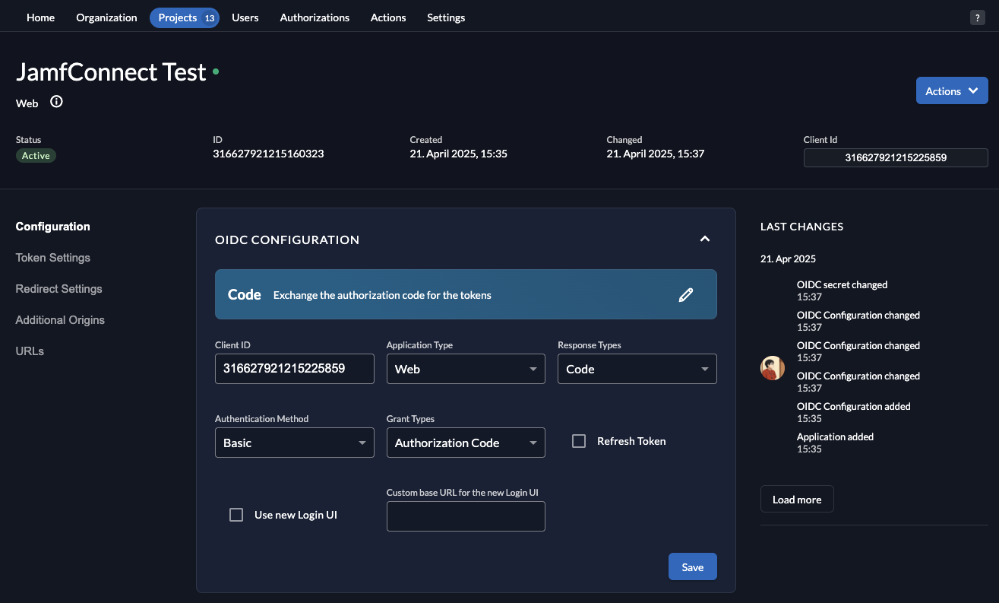

## Why a validation lab is needed

- When a target OIDC provider lacks full observability or cannot reliably reproduce login behavior, root-cause attribution becomes ambiguous.
- ZITADEL is a suitable controlled OIDC baseline because it can quickly provide standard-compliant apps and test identities for deterministic Jamf Connect checks.
- A controlled validation lab separates client-side (Jamf Connect) configuration causes from provider-side OIDC implementation causes.
- Screenshot reference: 
  <!-- media-description:for ./jamf-connect-application-screenshot.png -->
  This screenshot shows the Jamf Connect application configuration surface used as the client-side reference during OIDC validation. The lab keeps these client parameters fixed while comparing ZITADEL behavior against the target identity provider.
  <!-- media-description:end -->

## Pre-lab technical baseline

1. **Clock sync and TLS integrity**: align time across ZITADEL nodes, test devices, and directory services; apply valid TLS chain.
2. **Freeze OIDC parameters**: explicitly define `issuer`, `client_id`, `redirect URI`, `scope`, `response type`, and `grant_type`.
3. **Tiered test identities**: prepare standard user, admin user, and MFA-required user paths.
4. **Log retention policy**: define filename and retention conventions for both Jamf Connect and ZITADEL evidence.

## Validation workflow

1. **Apply Jamf Connect profile**: configure Jamf Connect on test endpoint/VM with ZITADEL parameters and verify profile consistency.
2. **Run standard login script**: test first login, password change, MFA, token refresh, and re-login in fixed order.
3. **Collect and correlate logs**: retain Jamf Connect, system, and ZITADEL events with aligned timestamps.
4. **Compare with target environment**: apply identical parameters against target OIDC and compare auth responses, `claim` structure, and error codes.
5. **Single-variable correction loop**: modify one parameter per iteration (for example `scope` or `redirect URI`) and retest.

## Common errors and triage order

1. **Login page opens but exchange fails**: verify exact `redirect URI` and `callback` path match, then check `client_secret` validity.
2. **Login succeeds but attributes do not map**: compare ID token/access token `claim` content with Jamf Connect mapping rules.
3. **MFA behavior inconsistent**: verify policy target-group match and device timezone/token expiry configuration.
4. **Intermittent failure**: inspect TLS chain stability and DNS resolution first, then reverse-proxy/WAF behavior.

## Technical validation checklist

1. ZITADEL lab reproduces complete login flow reliably.
2. Jamf Connect and OIDC parameter sets are versioned and recorded.
3. Both success and failure cases map to traceable evidence.
4. Comparison tests can clearly separate client-side and provider-side issues.
5. Each fix iteration changes one variable only for reproducible comparison.

## References

- Jamf Connect Documentation  
  https://learn.jamf.com/en-US/bundle/jamf-connect-documentation-current/page/About_Jamf_Connect.html
- ZITADEL OIDC Documentation  
  https://zitadel.com/docs/apis/openidoauth
- OpenID Connect Core 1.0  
  https://openid.net/specs/openid-connect-core-1_0.html
